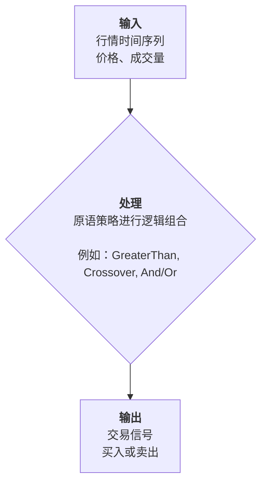

# 策略的艺术：从逻辑构建到实战优化

欢迎来到策略设计的世界！在这里，我们将共同探索如何将您的交易思想，转化为逻辑严密、行之有效的自动化策略。

策略的世界包罗万象，涵盖了从基本面分析、事件驱动到复杂的量化多因子模型。但正因其广阔，我们更需要一个清晰的起点。

在当前的原语策略体系中，我们选择专注于其中最经典、最纯粹的一类：**基于技术指标的交易策略**。

要掌握这类策略，关键在于建立一个清晰的心智模型。本质上，一个技术分析策略可以被看作一个精密的决策机器，它由三个核心部分构成：

*   **输入 (原材料)**：是源源不断的**行情时间序列**，就像一条奔流不息的市场数据长河（价格、成交量等）。
*   **处理 (大脑)**：是您设置的一系列**逻辑运算**，如同在这条河上建造的智能水坝和闸门，用于识别趋势、动量等交易机会。
*   **输出 (行动)**：是一个清晰的**布尔信号（买入/卖出）**，它直接决定了您的**持仓状态**——是满仓顺流而下，还是空仓静待时机。

这个过程可以直观地表示为：



### 原语策略的专注点与边界

在开始构建之前，理解原语策略的**能力边界**至关重要：

- **✔️ 原语策略非常擅长**：构建基于**单个标的、单个时间点**的复杂逻辑判断。您可以把它想象成一个功能强大的计算器，在每个交易日，它都会根据当天的最新数据，为您计算出“买入”或“卖出”的决策。它非常适合实现那些“当A条件和B条件满足，并且C条件不成立时就行动”的无状态逻辑。

- **❌ 原语策略无法实现**：需要**跨标的比较**或**记忆历史状态**的逻辑。例如，以下这些需求超出了原语策略的范围：
    - “在我的股票池中，选择过去20天涨幅最强的3只股票。” (需要跨标的比较)
    - “如果这是本月第三次出现金叉，则买入。” (需要记忆历史事件)

对于这类更复杂的、需要全局视角或历史记忆的策略，您应该使用平台预设的**代码策略**（如动量轮动策略），它们是为此类需求专门设计的。

我们接下来的目标，就是学习如何设计和建造这些智能、高效的‘闸门系统’，让它能精准地为您捕捉市场机遇。

现在，让我们开始吧！

## 🚨 从常见陷阱到制胜策略

让我们从一些最常见的错误模式入手，看看如何将它们转变为制胜的法宝。

### 陷阱 #1：等待完美风暴（多重瞬时信号组合）

#### ❌ 错误示范

想象一下，您要求“MACD金叉”、“均线金叉”和“RSI突破”这三件好事在**同一天**发生。

```json
{
  "id": "impossible_buy",
  "type": "And",
  "inputs": [
    {"ref": "macd_crossover"},     // 如同要求看到流星
    {"ref": "ma_crossover"},       // 同时听到钟声
    {"ref": "rsi_crossover"}       // 脚下还捡到钱包
  ]
}
```

**问题**：`Crossover`（交叉）这类信号是**瞬时**的，如同夜空中的流星，只在发生的那一刻闪现。要求多个这样的“流星”同时出现，概率微乎其微，您的策略可能永远等不来那个“完美风暴”。

#### ✅ 正确姿势

**方案一：从“等待闪电”到“沐浴阳光”**

用**持续性**的“状态”信号替换瞬时的“事件”信号。与其等待交叉的那一刻，不如确认一个持续向好的状态。

```json
{
  "id": "sustainable_buy", 
  "type": "And",
  "inputs": [
    {"ref": "macd_bullish"},       // 状态：MACD持续看涨
    {"ref": "ma_trending_up"},     // 状态：均线确认上升趋势
    {"ref": "rsi_moderate"}        // 状态：RSI处于健康区间
  ]
}
```

**方案二：构建“先决条件 + 触发器”逻辑**

将策略分为两层：首先满足核心的“大环境”条件，然后再等待一个合理的“入场”信号。

```json
{
  "id": "core_condition",
  "type": "And", 
  "inputs": [
    {"ref": "trend_confirmed"},    // 大环境：整体趋势向好
    {"ref": "volume_support"}      // 大环境：成交量健康
  ]
},
{
  "id": "entry_trigger",
  "type": "Or",
  "inputs": [
    {"ref": "macd_crossover"},     // 触发器1：MACD交叉
    {"ref": "ma_crossover"},       // 触发器2：均线交叉
    {"ref": "breakout_signal"}     // 触发器3：价格突破
  ]
},
{
  "id": "final_buy",
  "type": "And",
  "inputs": [
    {"ref": "core_condition"},     // 必须满足大环境
    {"ref": "entry_trigger"}       // 再等待任一触发器
  ]
}
```

### 陷阱 #2：条件太多，把自己“卷”死

#### ❌ 错误示范

```json
{
  "type": "And",
  "inputs": [
    {"ref": "condition1"},
    {"ref": "condition2"},
    {"ref": "condition3"},
    {"ref": "condition4"},
    {"ref": "condition5"},
    {"ref": "condition6"}         // 条件越多，越不可能同时满足
  ]
}
```

**问题**：每增加一个`And`条件，就像给投资机会多加了一道门槛。门槛太多，最终没有任何机会能够进来。

#### ✅ 正确姿势：区分“必须项”和“加分项”

```json
{
  "id": "essential_conditions",
  "type": "And",
  "inputs": [
    {"ref": "trend_up"},          // 必须项：上升趋势
    {"ref": "volume_ok"},         // 必须项：成交量健康
    {"ref": "risk_acceptable"}    // 必须项：风险可控
  ]
},
{
  "id": "additional_confirmations", 
  "type": "Or",
  "inputs": [
    {"ref": "momentum_strong"},   // 加分项：动能强劲
    {"ref": "sentiment_positive"},// 加分项：情绪积极
    {"ref": "technical_breakout"} // 加分项：技术突破
  ]
},
{
  "id": "final_signal",
  "type": "And", 
  "inputs": [
    {"ref": "essential_conditions"},      // 先满足所有必须项
    {"ref": "additional_confirmations"} // 再满足任一加分项
  ]
}
```

### 陷阱 #3：混淆“正在发生”与“刚刚发生”

#### 不同信号的时间特性

| 信号类型 | 特性比喻 | 适用场景 |
|---|---|---|
| **Crossover/Crossunder** | **闪电** (瞬时) | 捕捉转折点，作为行动的**触发器** |
| **GreaterThan/LessThan** | **晴天** (持续) | 确认一种状态，作为决策的**过滤器** |

#### ❌ 错误示范：用“闪电”来判断天气

```json
{
  "id": "wrong_trend_check",
  "type": "Crossover" // 用“刚刚金叉”这个瞬时事件
}
// ...来判断“现在是否是上升趋势”这个持续状态。错误！
```

#### ✅ 正确姿-势：在晴天寻找闪电

```json
{
  "id": "trend_direction", 
  "type": "GreaterThan" // 用“短期均线 > 长期均线”这个持续状态
}
// ...来判断“现在是否是上升趋势”。正确！
```

### 陷阱 #4：只知进攻，不懂防守

#### ❌ 错误示范：一个复杂的买入逻辑，配上一个简单的卖出逻辑

```json
{
  "buy_signal": "complex_buy_logic",
  "sell_signal": "simple_sell"      // 卖出策略被严重忽视
}
```

#### ✅ 正确姿势：构建一个攻守兼备的完整体系

一个成熟的策略，卖出逻辑和买入逻辑同等重要。

```json
{
  "id": "sell_signal",
  "type": "Or",
  "inputs": [
    {"ref": "stop_loss"},            // 防守1：止损，防止亏损扩大
    {"ref": "profit_target"},        // 防守2：止盈，锁定利润
    {"ref": "trend_reversal"}        // 防守3：趋势反转，及时离场
  ]
}
```

## 💣 策略之外的陷阱：当完美逻辑撞上残酷现实

即使您避开了以上所有逻辑陷阱，设计出一个回测曲线堪称完美的策略，在迈向实盘之前，仍然有几条巨大的鸿沟需要跨越。这些陷阱无关逻辑，却关乎现实。

### 陷阱 #5：数据陷阱 - “镜花水月”的乐观

策略的基石是数据，但数据本身可能带有欺骗性。

- **幸存者偏差 (Survivorship Bias)**：这是最经典的数据陷阱。我们今天看到的指数成分股、股票池，大部分都是“幸存者”。那些历史上被剔除、甚至破产的公司，在回测数据中可能已经消失。您的策略能在“优等生”组成的班级里取得好成绩，不代表它能在更真实的、包含“差等生”的残酷市场中幸存。

- **前视偏差 (Look-ahead Bias)**：这是一个更隐蔽的错误，指的是在模拟的“过去”某一天，不小心使用了那天“未来”才会知道的数据。例如，在开盘时就使用了当天的收盘价。虽然我们的平台底层已尽力规避此类问题，但您在设计复杂策略时仍需保持警惕：**确保所有决策都基于当前时间点及之前已确认可用的数据。**

### 陷阱 #6：回测陷阱 - “真空”中的理想化

回测是一个理想化的模拟环境，它与充满“摩擦”的真实世界有很大差异。

- **滑点 (Slippage)**：从信号出现到您的订单在交易所成交，价格可能已经向对您不利的方向跳动了几个价位。这个差价就是滑点。对于交易不活跃的标的或大资金的市价单，滑点会更严重，它会持续、稳定地侵蚀您的利润。

- **流动性风险 (Liquidity Risk)**：回测假设您随时可以买入或卖出。但真实世界中，股票可能**突然长期停牌**，让您的策略完全无法执行。等到复牌时，股价可能已“腰斩”，造成远超预期的损失。这是所有基于非ETF的策略都无法完全规避的“黑天鹅”风险。

> **重要认知**：虽然我们的回测已为您考虑了常规的**交易成本**（手续费、印花税等），但上述的**滑点**和**流动性风险**是回测无法完美模拟的。因此，请牢记：**您的真实收益，几乎总是会低于回测报告中的理想化收益。**

### 陷阱 #7：认知与执行陷阱 - “策略赚钱，我亏钱”

这是最致命、也最常见的陷阱，它源于我们自身。

- **“电梯测试”失败的黑箱策略**：您是否能用30秒（坐一次电梯的时间）向朋友解释清楚您的策略逻辑？如果不能，那它对您来说就是一个“黑箱”。当市场变化导致策略失效时，您将完全不知如何应对。

- **复杂性偏见：迷信‘屠龙之术’**：
  > “这么简单的策略，大家肯定都知道，肯定没用！”

  这是许多策略设计者滑向过度复杂化的第一步。他们错误地认为，只有复杂的、无人知晓的“秘密武器”才能战胜市场。但现实往往恰恰相反。

  - **简单不等于无效，它往往意味着稳健**：一个简单的策略（例如“长期趋势向上时，短期回调就买入”）就像一辆坚固的越野车。它可能不是最快的，但能适应各种崎岖不平的路况（多变的市场环境）。
  - **复杂不等于有效，它往往意味着脆弱**：一个极度复杂的策略，则像一辆为特定赛道（历史数据）精细调校的F1赛车。它在回测这条“完美赛道”上风驰电掣，但一旦未来的市场环境（路况）稍有变化，它就可能立刻抛锚。

  **为什么会这样？**

  因为市场的未来特征是不可预测的。简单的策略之所以更稳健，是因为它们通常抓住了市场最本质、最持久的规律（比如趋势会延续）。而过度复杂的策略，往往是在拟合历史数据中的“噪音”，当未来的市场“噪音”模式改变时，策略的根基就崩塌了。

  > **最终忠告**：您的目标不是创造一个能完美解释过去的、精巧脆弱的“艺术品”，而是要打造一个能适应不确定未来的、简单强大的“工具”。在策略设计中，追求的应是大道至简的优雅，而非缘木求鱼的繁复。

- **信任与纪律的鸿沟**：这是无数交易者失败的根源。让我们看一个真实的例子：

  > 想象一个趋势跟踪策略，它的回测报告非常漂亮：年化20%，但胜率只有40%，盈亏比高达4:1。这意味着它赚钱主要靠少数几次“大胜”。
  >
  > 您开始实盘跟单。第一笔交易，小亏2%；第二笔，小亏3%；第三笔，又小亏2.5%。连续三次亏损后，您的信心开始动摇：“这策略是不是失效了？”
  >
  > 第四次买入信号出现时，您犹豫了，选择了放弃。
  >
  > **结果，这第四笔交易，恰好抓到了一波主升浪，盈利了30%，足以覆盖之前所有的亏损并带来丰厚回报。**
  >
  > 最终的结果是：策略的模拟盘大赚，而您的实盘却因为放弃了关键一役而亏损。

- **解药：深度理解是信任的唯一基石**

  在投入真实资金前，您必须像研究“体检报告”一样，去深入理解策略的每一个风险收益指标。这正是我们为您提供详细组合分析页面的原因。

  - **胜率 (Win Rate)**：看到一个40%的胜率，您就应该有心理准备：“**连续三四次亏损是这个策略的正常现象，而不是它失效的证据。**”
  - **盈亏比 (Profit/Loss Ratio)**：看到4:1的盈亏比，您才能建立信心：“**我愿意用这几次可控的小额亏损，去博取那一次可能的大幅盈利。**”
  - **最大回撤 (Max Drawdown)**：看到25%的最大回撤，您需要问自己：“**当我的账户真的浮亏25%时，我还能睡得着觉、坚持执行信号吗？**”
  - **波动率 (Volatility)**：它反映了策略净值的波动剧烈程度，是风险最直接的体现。同样的策略应用在不同波动率的标的（如科技股 vs 公用事业股）上，其风险表现会截然不同。您必须选择一个波动率在您心理舒适区内的策略，才能在市场的大起大-落中保持平稳心态，从而更容易地坚持下去。

> **最终忠告**：一个您能深度理解其风险、简单到足以让您在逆境中依然信任并坚持执行的策略，远胜过一个您无法掌握的、回测曲线再完美的复杂“黑箱”。

## 📋 您的策略设计清单

在发布您的策略前，不妨用这个清单做个快速体检：

### 买入逻辑
- [ ] 是否避免了多个“闪电”式信号的`And`组合？
- [ ] `And`条件是否简洁有力（建议3-4个以内）？
- [ ] 是否清晰地区分了“大环境”和“触发器”？

### 卖出逻辑
- [ ] 有没有明确的止损安全网？
- [ ] 有没有合理的止盈目标？
- [ ] 当市场风向变了，策略懂得离场吗？

### 整体健康度
- [ ] 策略背后的投资理念清晰吗？
- [ ] 交易频率是否在合理范围内？
- [ ] 它能适应不同的市场环境吗？

## 🔍 策略调试的艺术：开启您的“上帝视角”

### 您的策略调试仪表盘：信号分析页面

想知道您的策略在想什么吗？我们为您准备了强大的**信号分析**功能。

它就像一个策略的“仪表盘”，让您能清晰地看到每一个信号的触发情况，洞察其内在逻辑。

**如何访问？**
很简单，只需在您的投资组合URL后面加上 `/signals/` 即可。
例如，对于名为 `my_portfolio` 的组合，访问：
`https://www.myinvestpilot.com/portfolios/my_portfolio/signals/`

**用它做什么？**
- **透视逻辑**：分步查看每个独立信号和组合逻辑的计算结果。
- **诊断健康度**：分析信号的触发频率。一个从未触发或过于频繁的信号，通常是逻辑缺陷的警报。

### 从简到繁，逐个击破

在复杂的策略出问题时，不妨先用一个极简的配置来测试核心逻辑，再逐步添加其他部分。

```json
{
  "description": "调试专用：先只看最核心的买入条件",
  "buy_signal": "single_condition",
  "sell_signal": "simple_stop_loss"
}
```

## 📖 原语策略的组合范式

现在，让我们来看一些真正能发挥原语策略优势的、强大而实用的组合范式。这些范式都严格遵守了原语策略的无状态特性，专注于构建单时间点上的复杂逻辑判断。

### 范式一：趋势过滤下的精确打击

**理念**：只在市场大趋势对我们有利时，才去捕捉短期的交易信号。这就像只在顺风时扬帆，能极大提高胜算。

**结构**：`主要趋势判断 (持续状态) AND 入场触发信号 (瞬时事件)`

```json
{
  "id": "buy_with_trend_filter",
  "type": "And",
  "inputs": [
    {
      "id": "is_uptrend",
      "type": "GreaterThan",
      "inputs": [ {"column": "Close"}, {"ref": "long_term_ma"} ]
    },
    {
      "id": "entry_trigger",
      "type": "Crossover",
      "inputs": [ {"ref": "short_term_ma"}, {"ref": "medium_term_ma"} ]
    }
  ]
}
```

**解读**：
1.  `is_uptrend`：首先用`GreaterThan`判断当前收盘价是否在长期均线（如200日线）之上，这是一个持续的“状态”过滤，确保我们只在牛市或上升趋势中操作。
2.  `entry_trigger`：然后用`Crossover`等待一个短中期均线（如20日线上穿50日线）的金叉，这是一个瞬时的“事件”作为扳机。

### 范式二：多重指标共振确认

**理念**：避免单一指标的误判，要求多个来自不同维度（如趋势、动量、波动性）的指标同时发出信号，形成“共振”，信号的可靠性将**指数级**提升。

**结构**：`指标A信号 AND 指标B信号 AND 指标C信号`

```json
{
  "id": "buy_with_resonance",
  "type": "And",
  "inputs": [
    { "ref": "ma_crossover_signal" },      // 趋势确认
    { "ref": "rsi_oversold_signal" },      // 动量确认
    { "ref": "volume_surge_signal" }       // 成交量确认
  ]
}
```

**解读**：这个策略要求“均线金叉”、“RSI超卖反弹”和“成交量激增”三个条件同时满足。虽然触发会更少，但每一次触发都意味着市场多个维度都发出了强烈的看涨信号。

### 范式三：风险优先的“非对称”逻辑

**理念**：构建买入和卖出逻辑时，采用不同的标准。通常，买入条件可以更苛刻，而卖出（尤其是止损）条件则应该更灵敏、更优先。

**结构**：
- **买入**：`严格的核心条件 AND 触发条件`
- **卖出**：`止损信号 OR 止盈信号 OR 趋势反转信号`

```json
// 卖出逻辑示例
{
  "id": "comprehensive_sell_signal",
  "type": "Or",
  "inputs": [
    { "ref": "chandelier_exit_stop_loss" }, // 基于波动率的动态止损
    { "ref": "bollinger_upper_band_touch" },// 触及布林带上轨止盈
    { "ref": "long_term_trend_reversal" }  // 长期趋势反转信号
  ]
}
```

**解读**：`Or`逻辑确保了任何一个危险信号出现时，策略都会优先执行卖出操作以控制风险。这体现了“生存第一，盈利第二”的稳健交易思想。

## 💡 总结要点

1.  **简单优于复杂**: 3-4个核心条件比10个复杂条件更有效
2.  **理解信号特性**: Crossover用于触发，Comparison用于过滤
3.  **分层设计**: 核心条件 + 触发条件 + 风险控制
4.  **迭代优化**: 从简单策略开始，逐步完善
5.  **数据验证**: 用历史数据和信号分析工具，无情地拷问您的策略逻辑

记住：一个能稳定触发信号、风险可控的简单策略，远好过一个逻辑完美但从不执行的复杂策略。
